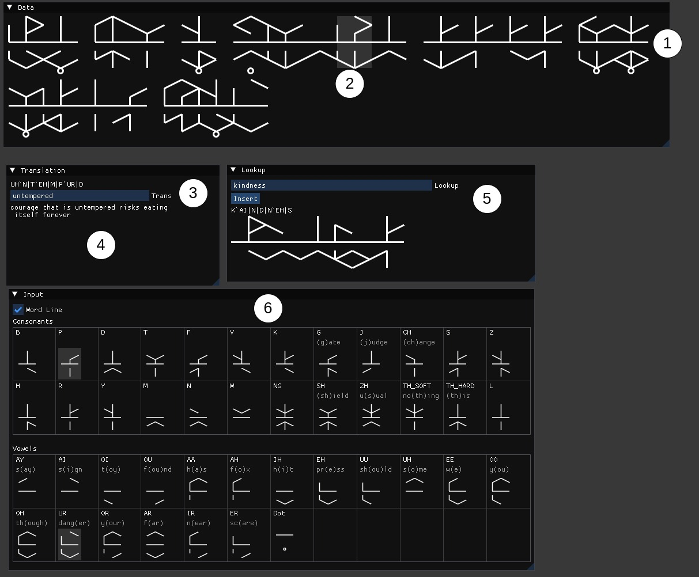

# trunic-translate
Tool for translating/writing the language from Tunic

Usage:
`python tunic.py`

Keybinds:
- Space: next character
- Enter: next word
- Backspace: delete character/word

Legend:
1. Trunic text display
2. Selected character/word
3. Selected word translation
4. Full translated text
5. Translated word lookup (press enter to insert)
6. Character editor

Translated words are stored in a local sqlite db.